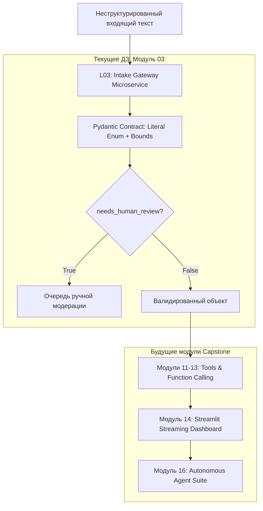

# Спецификация домашнего задания: Входной типизированный шлюз (Capstone Milestone 1)

> **Модуль:** GenAI Basics — Урок 03: LLM API с Python  
> **Цель артефакта:** Создание первого производственного микросервиса сквозного проекта (Capstone Project)  
> **Оценка:** 10 баллов  
> **Срок сдачи:** До начала следующего занятия

---

## 1. Связь со сквозным проектом (Capstone Architecture)

В сквозном проекте курса студенты создают **Автономную систему операционного триажа и обработки заявок (Intake & Routing AI Agent)**.

Сквозная цепочка развития проекта:
1. **Модуль 01:** Бизнес-требования, анализ рисков и определение точек участия человека (Human-in-the-Loop).
2. **Модуль 02:** Расчет токенов, проектирование системных промптов и контекстное заземление.
3. **Модуль 03 (ТЕКУЩИЙ ЭТАП): Ядро входного типизированного шлюза (`contracts.py`, обработка неструктурированного текста, валидация, отлов неопределенности).**
4. **Модули 11–13:** Подключение Function Calling (запись тикета в базу данных, интеграция с внешними API).
5. **Модуль 14:** Создание стримингового пользовательского интерфейса на Streamlit.
6. **Модуль 16:** Упаковка в автономного агента с файлами инструкций `AGENTS.md` и верификационными тестами.



---

## 2. Постановка задачи для студента

Вам необходимо создать изолированный Python-репозиторий (или подпапку), реализующий контракт входного шлюза для одного из выбранных бизнес-доменов:

### Домены на выбор:
1. **IT Support / Bug Triage:** Разбор жалоб пользователей на ошибки ПО, определение критичности, модуля системы и шагов воспроизведения.
2. **Customer Feedback & NPS:** Анализ отзывов клиентов, определение тональности (1–10), категории проблемы и готовности к оттоку.
3. **Internal HR / Operations Desk:** Заявки сотрудников на отпуск, замену оборудования, оформление справок.
4. **Event & Conference Inquiries:** Обработка заявок на спонсорство, доклады спикеров или покупку групповых билетов.

---

## 3. Требования к структуре артефакта

Студент сдает репозиторий со следующей файловой структурой:

```
capstone_intake_service/
├── .env.example              # Образец переменных окружения (без секретов!)
├── .gitignore                # Игнорирование .env, __pycache__, venv
├── contracts.py              # Pydantic-схема контракта данных
├── classify.py               # Основной скрипт вызова API со структурированным выводом
├── common.py                 # Инициализация клиента, логирование, таймеры
├── examples/
│   ├── clear.txt             # Очевидный пример запроса (высокая уверенность)
│   └── ambiguous.txt         # Двусмысленный / неполный запрос (требует человека)
├── tests/
│   └── test_contract.py      # Детерминированные юнит-тесты без сетевых вызовов
├── README.md                 # Описание контракта, правила бизнес-валидации
└── EVIDENCE.md               # Лог успешного вызова с телеметрией (без утечки ключей)
```

---

## 4. Спецификация контракта (`contracts.py`)

Модель Pydantic должна удовлетворять следующим требованиям:
1. Минимум один строго типизированный `Literal[...]` энум (например, `category` или `priority`).
2. Ограниченные текстовые поля (`Field(description=..., max_length=...)`).
3. Поле числовой оценки или скоринга с валидацией границ (например, `ge=1, le=10` или `ge=0.0, le=1.0`).
4. **Обязательное поле обработки неопределенности:** `needs_human_review: bool` и сопутствующее поле `review_reason: Optional[str] = None`.

---

## 5. Требования к тестам (`tests/test_contract.py`)

Тестовый набор должен быть полностью **детерминированным** и выполняться оффлайн без вызова платных API:
- Тест 1: Валидация корректного словаря/JSON проходит успешно.
- Тест 2: Передача недопустимого значения энума (например, `category="unknown_thing"`) вызывает `ValidationError`.
- Тест 3: Выход за границы числового диапазона вызывает `ValidationError`.
- Тест 4: Проверка логики флага неопределенности: если запрос помечен как неясный, `needs_human_review` обязан быть `True`.

---

## 6. Рубрика оценивания (10 баллов)

| Критерий | Баллы | Что проверяет преподаватель |
| :--- | :---: | :--- |
| **Качество контракта (Contract Quality)** | **2** | Поля и типы обоснованы; использованы энумы и ограничения; контракт лаконичен и расширяем. |
| **Обработка неопределенности (Ambiguity Handling)** | **2** | В `ambiguous.txt` представлен реальный сложный кейс; система не гадает, а безопасно выставляет флаг передачи человеку. |
| **Детерминированные тесты (Unit Tests)** | **2** | Юнит-тесты покрывают негативные кейсы и отрабатывают локально за < 1 сек без сетевых вызовов. |
| **Граница API и безопасность (API Boundary)** | **2** | Ключи не закоммичены в git; модель и параметры передаются через переменные окружения; задан дедлайн `timeout`. |
| **Телеметрия и доказательства (Evidence)** | **1** | В `EVIDENCE.md` зафиксированы `request_id`, токены, задержка и итоговый JSON без утечки конфиденциальных данных. |
| **Инженерное объяснение (Reflection)** | **1** | В `README.md` написано 100–150 слов: что схема *гарантирует* (синтаксис), а что *не гарантирует* (семантика и бизнес-правила). |

---

## 7. Готовый шаблон для старта студента

Студенты могут опираться на код в локальной папке курса:
`GenAI Basics — Course Production/L03/demo_repo/`
- Запуск тестов: `python tests/test_contract.py`
- Локальная проверка валидации: `python 05_local_validation.py`
