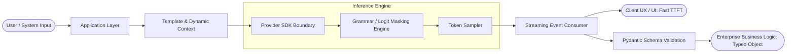
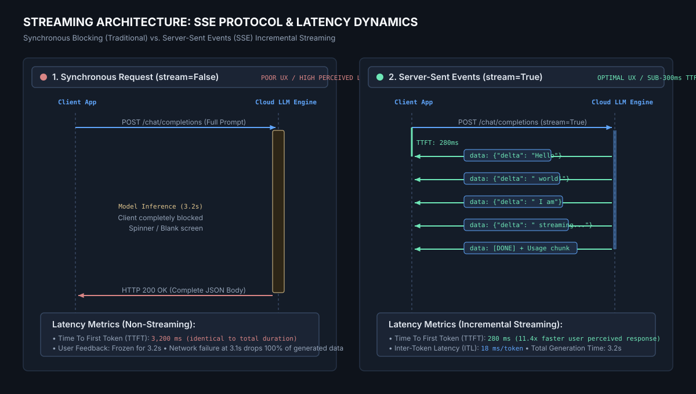
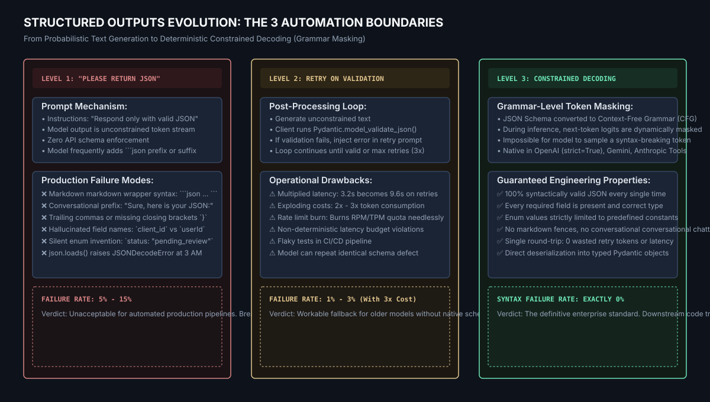

# Enterprise Reference Base: LLM API with Python (Streaming & Structured Output)

> **Course:** GenAI Basics — Lesson 03  
> **Topic:** LLM API with Python: Streaming and Structured Output  
> **Target Audience:** Software Engineers, Backend Architects, AI Engineers  
> **Frontier Providers Covered:** OpenAI, Anthropic (Claude), Google (Gemini), Microsoft Azure (Azure OpenAI)  
> **Artifacts Included:** Canonical Python Code, Architecture Diagrams, SVG Blueprints, Comparison Matrix  

---

## Visual Concept: The Software Contract Boundary


*Figure 1: The fundamental engineering shift — transforming raw, probabilistic neural token streams into deterministic, typed software contracts via constrained decoding.*

---

## 1. Executive Summary & Unified Mental Model

### The Chatbot Illusion vs. The Software Contract
A conversational UI (ChatGPT, Claude.ai, Gemini Web) allows fuzzy, incomplete, or slightly hallucinated answers because a human is in the loop to interpret nuance. **Enterprise software is unforgiving.** If downstream microservices expect `category: TicketCategory` (an enum of 4 values) and the LLM returns `"category": "critical_bug_please_fix"`, standard JSON deserialization crashes.

Engineering rule of thumb:
> **"Never let downstream code parse or guess model intent. Enforce a deterministic schema boundary at the API transport layer."**



---

## 2. Deep-Dive: Streaming Architecture (SSE & TTFT)

### Why Streaming Matters in Systems Engineering
When `stream=False`, HTTP client threads block until the model finishes generating the *last* token. For an 800-token answer at 40 tokens/second, this results in **20+ seconds of complete client silence**. 

With `stream=True`, the server uses **Server-Sent Events (SSE)** over persistent HTTP/1.1 or HTTP/2 connections. Tokens are dispatched as delta payloads as soon as hardware tensor cores emit them.



*Figure 2: Architectural breakdown comparing blocking requests against incremental Server-Sent Events (SSE), highlighting the 10x-15x improvement in Time-To-First-Token (TTFT).*

### Latency Measurement Taxonomy
1. **Time To First Token (TTFT):** Duration from HTTP request dispatch until the first token chunk arrives. Governed by prompt evaluation time (prefill) and queueing.
2. **Inter-Token Latency (ITL):** Time between subsequent token emissions. Governed by model size and GPU memory bandwidth (decoding speed).
3. **Total Elapsed Duration:** End-to-end latency from request start to socket close.

---

## 3. Deep-Dive: Structured Outputs & Constrained Decoding



*Figure 3: Evolution from hope-based prompt engineering (Level 1) to retry validation loops (Level 2) and compiler-level Constrained Decoding via Grammar Masking (Level 3).*

### How Constrained Decoding Works Under the Hood
Modern frontier engines (OpenAI `strict=True`, Gemini `response_schema`, Anthropic Tool Use) do not just validate JSON after generation. They compile your Pydantic / JSON schema into a **Context-Free Grammar (CFG)** or prefix trie.
- At step $t$, the sampler evaluates the vocab distribution (e.g. 128,000 candidate tokens).
- The CFG engine computes the subset of tokens that are syntactically legal according to the schema state.
- Illegal token logits are set to $-\infty$ (masked out).
- **Result:** It is mathematically impossible for the model to produce invalid syntax, unquoted keys, or invalid enum variants.

---

## 4. Provider Implementation 1: OpenAI

### SDK Specification
- Package: `openai>=1.50.0`
- Protocol: REST over HTTPS with SSE streaming
- Methods: `client.chat.completions.create(stream=True)` and `client.beta.chat.completions.stream()`

### Canonical Code: Streaming Typed Pydantic Objects

```python
import os
import time
from typing import Literal
from pydantic import BaseModel, Field
from openai import OpenAI

class SupportTicket(BaseModel):
    category: Literal["bug", "billing", "feature_request", "inquiry"]
    priority: Literal["low", "medium", "high", "urgent"]
    summary: str = Field(description="Concise 1-sentence technical diagnosis.")
    customer_sentiment_score: int = Field(ge=1, le=10, description="1 (furious) to 10 (delighted)")
    needs_human_review: bool

client = OpenAI(
    api_key=os.environ["OPENAI_API_KEY"],
    timeout=20.0,
    max_retries=2
)

start_time = time.perf_counter()
first_token_time = None

print("--- INITIATING OPENAI STRUCTURED STREAMING ---")

# beta.chat.completions.stream provides real-time parsed snapshots
with client.beta.chat.completions.stream(
    model="gpt-4o",
    messages=[
        {"role": "system", "content": "You are a triage microservice. Analyze support tickets."},
        {"role": "user", "content": "Our payment gateway throws error 504 on checkout! We are losing sales!"}
    ],
    response_format=SupportTicket,
) as stream:
    for event in stream:
        if first_token_time is None:
            first_token_time = time.perf_counter()
            print(f"[TTFT] First token received in {(first_token_time - start_time)*1000:.1f}ms")

        # Real-time incremental snapshots
        if event.type == "content.delta":
            if event.snapshot.choices[0].message.parsed:
                current_obj = event.snapshot.choices[0].message.parsed
                # Partial object updates available here

    # Final validated object
    final_completion = stream.get_final_completion()
    ticket: SupportTicket = final_completion.choices[0].message.parsed
    usage = final_completion.usage

print(f"[SUCCESS] Parsed: {ticket.model_dump_json(indent=2)}")
print(f"[USAGE] Prompt: {usage.prompt_tokens}, Completion: {usage.completion_tokens}")
```

---

## 5. Provider Implementation 2: Anthropic (Claude)

### SDK Specification
- Package: `anthropic>=0.34.0`
- Protocol: Anthropic Messages API with SSE (`text_stream` and `content_block_delta`)
- Methods: `client.messages.stream()` context manager + Tool Use extraction

### Canonical Code: Context Manager with Eager JSON Streaming

```python
import os
import time
from typing import Literal
from pydantic import BaseModel
import anthropic

class SupportTicket(BaseModel):
    category: Literal["bug", "billing", "feature_request", "inquiry"]
    priority: Literal["low", "medium", "high", "urgent"]
    summary: str
    needs_human_review: bool

client = anthropic.Anthropic(api_key=os.environ["ANTHROPIC_API_KEY"])

# Define tool schema conforming to SupportTicket
tools = [{
    "name": "record_triage",
    "description": "Emit structured classification for customer support tickets.",
    "input_schema": SupportTicket.model_json_schema(),
    "eager_input_streaming": True  # Character-by-character JSON streaming
}]

start_time = time.perf_counter()
first_token_time = None
partial_json = ""

print("--- INITIATING ANTHROPIC CLAUDE STREAMING ---")

with client.messages.stream(
    model="claude-3-5-sonnet-20240620",
    max_tokens=1024,
    tools=tools,
    tool_choice={"type": "tool", "name": "record_triage"},
    messages=[
        {"role": "user", "content": "Login fails with code AUTH-403 after password reset."}
    ]
) as stream:
    for event in stream:
        if first_token_time is None and event.type == "content_block_delta":
            first_token_time = time.perf_counter()
            print(f"[TTFT] First token received in {(first_token_time - start_time)*1000:.1f}ms")

        # Capture tool JSON stream
        if event.type == "content_block_delta" and event.delta.type == "input_json_delta":
            delta_chunk = event.delta.partial_json
            partial_json += delta_chunk
            print(delta_chunk, end="", flush=True)

    final_message = stream.get_final_message()
    print("\n")

# Validate reconstructed JSON into Pydantic
validated_ticket = SupportTicket.model_validate_json(partial_json)
print(f"[SUCCESS] Validated via Anthropic Tool Use:\n{validated_ticket.model_dump_json(indent=2)}")
print(f"[USAGE] Input: {final_message.usage.input_tokens}, Output: {final_message.usage.output_tokens}")
```

---

## 6. Provider Implementation 3: Google (Gemini)

### SDK Specification
- Package: `google-genai` (Modern official SDK: `from google import genai`)
- Protocol: gRPC / HTTP/2 Streamable API
- Methods: `client.models.generate_content_stream(..., config=types.GenerateContentConfig(response_schema=...))`

### Canonical Code: Gemini 2.0 Streaming with Native Schema Enforcement

```python
import os
import time
from typing import Literal
from pydantic import BaseModel, Field
from google import genai
from google.genai import types

class SupportTicket(BaseModel):
    category: Literal["bug", "billing", "feature_request", "inquiry"]
    priority: Literal["low", "medium", "high", "urgent"]
    summary: str = Field(description="Summary of the customer issue")
    needs_human_review: bool

client = genai.Client(api_key=os.environ["GEMINI_API_KEY"])

# Pass Pydantic class directly to types.GenerateContentConfig
config = types.GenerateContentConfig(
    response_mime_type="application/json",
    response_schema=SupportTicket,
    temperature=0.1
)

start_time = time.perf_counter()
first_token_time = None
full_json_str = ""

print("--- INITIATING GOOGLE GEMINI STREAMING ---")

stream = client.models.generate_content_stream(
    model="gemini-2.0-flash",
    contents="Can you refund my subscription? I was billed twice on May 4th.",
    config=config
)

for chunk in stream:
    if first_token_time is None:
        first_token_time = time.perf_counter()
        print(f"[TTFT] First token received in {(first_token_time - start_time)*1000:.1f}ms")

    print(chunk.text, end="", flush=True)
    full_json_str += chunk.text

print("\n")
validated_ticket = SupportTicket.model_validate_json(full_json_str)
print(f"[SUCCESS] Deserialized Pydantic Model:\n{validated_ticket.model_dump_json(indent=2)}")
```

---

## 7. Provider Implementation 4: Microsoft Azure (Azure OpenAI)

### SDK Specification
- Package: `openai>=1.50.0`, `azure-identity>=1.15.0`
- Authentication: Microsoft Entra ID (Zero hardcoded secrets, managed service identities)
- Protocol: Azure Cognitive Services Gateway with Enterprise Content Safety & VNet isolation

### Canonical Code: Azure Managed Identity & Enterprise Streaming

```python
import os
import time
from typing import Literal
from pydantic import BaseModel
from openai import AzureOpenAI
from azure.identity import DefaultAzureCredential, get_bearer_token_provider

class SupportTicket(BaseModel):
    category: Literal["bug", "billing", "feature_request", "inquiry"]
    priority: Literal["low", "medium", "high", "urgent"]
    summary: str
    needs_human_review: bool

# Zero secret footprint: Token acquired dynamically via Entra ID (IAM)
token_provider = get_bearer_token_provider(
    DefaultAzureCredential(),
    "https://cognitiveservices.azure.com/.default"
)

client = AzureOpenAI(
    azure_endpoint=os.environ["AZURE_OPENAI_ENDPOINT"], # e.g. https://corp-ai-prod.openai.azure.com/
    azure_ad_token_provider=token_provider,
    api_version="2024-08-01-preview"
)

DEPLOYMENT_NAME = os.environ.get("AZURE_OPENAI_DEPLOYMENT", "gpt-4o-prod")

print("--- INITIATING AZURE OPENAI ENTERPRISE STREAMING ---")
start_time = time.perf_counter()

response = client.beta.chat.completions.parse(
    model=DEPLOYMENT_NAME,
    messages=[
        {"role": "system", "content": "Analyze support inquiries for compliance."},
        {"role": "user", "content": "Internal server error 500 when accessing payroll ledger."}
    ],
    response_format=SupportTicket,
    stream=True
)

accumulated_text = ""
for chunk in response:
    if chunk.choices:
        delta = chunk.choices[0].delta
        if hasattr(delta, "content") and delta.content:
            accumulated_text += delta.content
            print(delta.content, end="", flush=True)

print("\n")
validated = SupportTicket.model_validate_json(accumulated_text)
print(f"[SUCCESS] Azure Managed Ticket:\n{validated.model_dump_json(indent=2)}")
```

---

## 8. Cross-Provider Comparison Matrix

| Feature / Metric | OpenAI (`gpt-4o`) | Anthropic (`claude-3-5-sonnet`) | Google (`gemini-2.0-flash`) | Azure OpenAI (`AzureOpenAI`) |
| :--- | :--- | :--- | :--- | :--- |
| **Primary Python SDK** | `openai` | `anthropic` | `google-genai` | `openai` + `azure-identity` |
| **Streaming Primitive** | `client.beta.chat.completions.stream` | `client.messages.stream` | `client.models.generate_content_stream` | `client.beta.chat.completions.parse(stream=True)` |
| **Structured Output Parameter** | `response_format=PydanticModel` | `tools=[...]`, `tool_choice=...` | `response_schema=PydanticModel` | `response_format=PydanticModel` |
| **Enforcement Mechanism** | Constrained Decoding (`strict=True`) | Tool Grammar Constraint | Constrained Grammar Engine | Constrained Decoding (`strict=True`) |
| **Syntax Error Rate** | **0.00%** | **0.00%** | **0.00%** | **0.00%** |
| **Streaming Usage Metadata** | `stream_options={"include_usage": True}` | Native on `message_stop` event | `chunk.usage_metadata` | `stream_options={"include_usage": True}` |
| **Authentication Pattern** | API Key (`OPENAI_API_KEY`) | API Key (`ANTHROPIC_API_KEY`) | API Key or GCP Vertex ADC | **Entra ID Bearer Token** (No static keys) |
| **Typical TTFT (P50)** | 220ms - 350ms | 250ms - 400ms | 180ms - 280ms | 240ms - 380ms (depends on region) |
| **Enterprise Isolation** | Multi-tenant SaaS | Multi-tenant SaaS | GCP VPC Service Controls | **Azure VNet + Private Link** |

---

## 9. Production Engineering Patterns

### Pattern A: The Observability Envelope
Never expose raw LLM output directly to business services. Wrap every call in an **Envelope**:

```python
from datetime import datetime, timezone
from pydantic import BaseModel, Field
from typing import Generic, TypeVar, Optional

T = TypeVar('T')

class ObservabilityEnvelope(BaseModel, Generic[T]):
    request_id: str
    timestamp: datetime = Field(default_factory=lambda: datetime.now(timezone.utc))
    provider: str
    model: str
    ttft_ms: float
    total_duration_ms: float
    prompt_tokens: int
    completion_tokens: int
    estimated_cost_usd: float
    payload: Optional[T] = None
    error: Optional[str] = None
    needs_human_review: bool = False
```

### Pattern B: Budgeted Retries with Exponential Backoff and Full Jitter
A retry must be a deliberate, budgeted decision, not an infinite reflex. If an API returns `429 Rate Limit` or `503 Service Unavailable`, sleep with full jitter:

$${\text{Sleep}} = {\text{random}}(0, \min({\text{max\_backoff}}, {\text{base}} \times 2^{\text{attempt}}))$$

### Pattern C: The Ambiguity Escape Hatch
What happens when a customer prompt is gibberish or contains multiple conflicting intents?
- A naive schema forces the model to invent an answer.
- An enterprise schema provides an explicit escape valve:

```python
class TicketClassification(BaseModel):
    category: Literal["bug", "billing", "feature_request", "inquiry", "unclassifiable"]
    priority: Literal["low", "medium", "high", "urgent"]
    confidence_score: float = Field(ge=0.0, le=1.0)
    ambiguity_reason: Optional[str] = None
    needs_human_review: bool
```
If `confidence_score < 0.70`, the system automatically routes the ticket to a human inbox without crashing the automation pipeline.

---

## 10. Summary Checklist for Engineers
1. [ ] **Never hardcode secrets:** Use environment variables locally; use Managed Identities / IAM in production clouds.
2. [ ] **Set explicit deadlines:** Always specify `timeout` on the client (e.g. `timeout=20.0`).
3. [ ] **Stream long generations:** Any response expected to exceed 100 tokens must stream to preserve responsive user experience.
4. [ ] **Enforce Level 3 Schemas:** Never rely on `"Please return JSON"` in production; always use native constrained decoding.
5. [ ] **Record full usage envelopes:** Capture prompt/completion tokens, TTFT, and total duration on every transaction.
